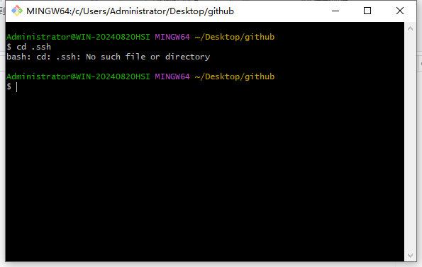
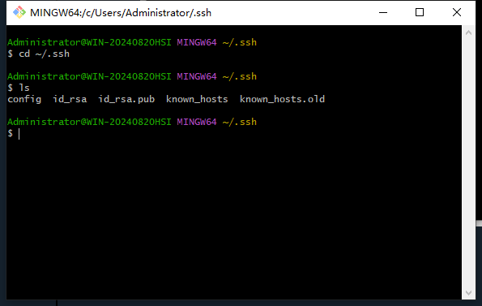
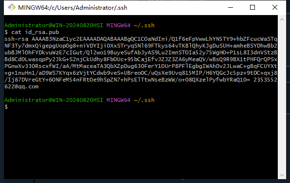
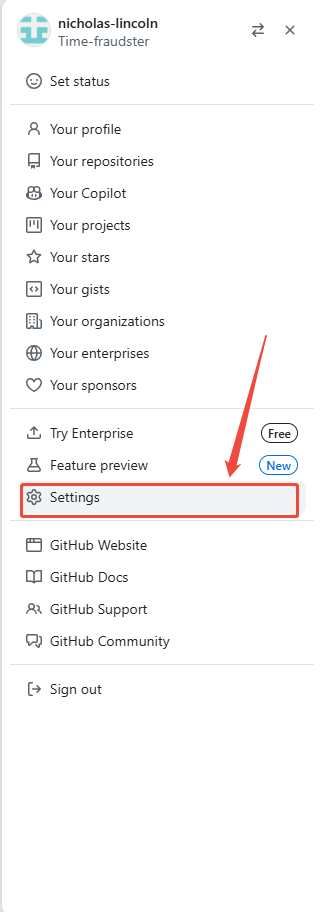
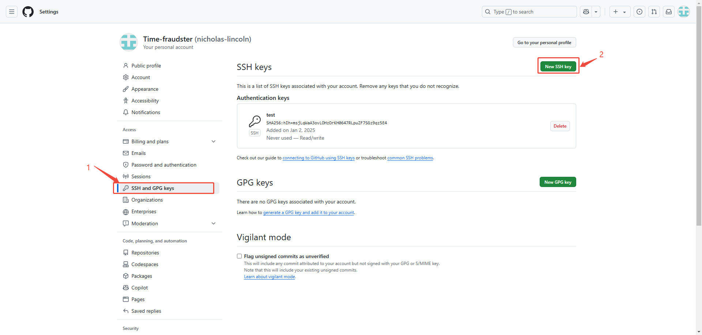
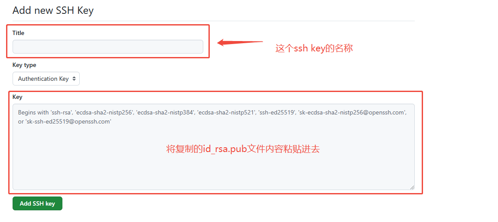
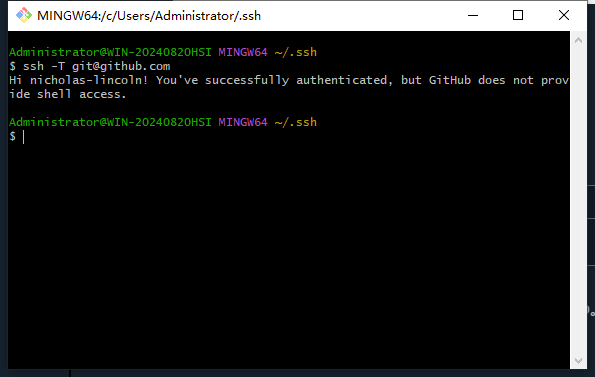

# GitHub-SSH连接

# 配置GitHub-ssh连接

## 配置SSH

git使用SSH配置， 初始需要以下三个步骤

1. 使用秘钥生成工具生成rsa秘钥和公钥
2. 将rsa公钥添加到代码托管平台
3. 将rsa秘钥添加到ssh-agent中，为ssh client指定使用的秘钥文件

‍

### 第一步：检查本地主机是否已经存在ssh key

```
cd ~/.ssh
ls
//看是否存在 id_rsa 和 id_rsa.pub文件，如果存在，说明已经有SSH Key
```

如果报错如下：

​​

则按顺序进行第二步，如果为下图所示：

​​

且你曾未配置过GitHub-ssh连接，则删除该目录下所有文件。

### 第二步：生成SSH密钥对

#### 1.打开终端/命令行工具：

1. Windows下可以使用Git Bash或Power Shell。
2. macOS/Linux下可以直接打开终端应用。

#### 2.生成新的SSH密钥对

```ruby
ssh-keygen -t rsa -C "your_email@example.com"
// 或
ssh-keygen
//执行后一直回车即可
```

**注**：	-t = The type of the key to generate为密钥的类型  
	-C = comment to identify the key为用于识别这个密钥的注释

#### 3.保存密钥文件

1. 按回车接受默认路径（通常是 ~/.ssh/id_ed25519 或 ~/.ssh/id_rsa），或者选择其他位置。
2. 设置密码保护（可选但推荐），这将增加安全性。
3. 如果不设置，密码按回车即可

### 第三步：启动SSH代理并添加密钥

#### 1.启动SSH代理

对于Linux和macOS系统，可以直接在终端中输入：

```
eval "$(ssh-agent -s)"
```

Windows下可以在Git Bash中执行相同的命令

获取ssh key公钥内容（id_rsa.pub)

```
cd ~/.ssh
cat id_rsa.pub
```

如图所示，复制该内容

​​

添加私钥到SSH代理：

1. 使用下面的命令添加刚生成的私钥：

```
ssh-add ~/.ssh/id_rsa
```

2. 其~/.ssh/id_rsa为私钥地址，如更改私钥保存位置，请替换上述路径为实际路径

#### 2.添加公钥到GitHub

登录GitHub账号，进入Settings设置

​​

添加新的ssh key

​​

粘贴复制的公钥并保存

​​

### 第四步：验证SSH连接

#### 1.测试连接

1. 使用以下命令测试是否能成功通过SSH连接到GitHub：

```ruby
ssh -T git@github.com
```

1. 如出现下图所示，表明已经成功地用SSH连接到GitHub。

‍

​​

3. 如有问题，补充config文件，在.ssh/目录下创建config文件

‍

```
Host github.com
Hostname ssh.github.com
Port 443
User git
IdentityFile ~/.ssh/id_rsa
```

**注：** 其中IdentityFile ~/.ssh/id_rsa为私钥的路径
